# Controle de Inventário

Atividade de back end, SESI/SENAI, aula_05, onde é criado o inventário para uma empresa fictícia com as opções de adicionar, atualizar, deletar e buscar por informações desse inventário

## Como Testar

- 1 Clonar este repositório
- Abrir com o VsCode e em um terminal digitar os seguintes comandos
```bash
npm install
npm run dev
```
-Instale o Thunder Client e simule o programa nele
"lembre-se de definir o 'dev' nas configurações 'sripts' no 'pakage-json'"

OBS.: Caso queira atualizar alguma informação o código ou alterar algo, você deve, após salvar as alterações com "ctrl" + "S", reiniciar o programa do terminal apertando "ctrl" + "c", digitar "S" e digitar "npm run dev" novamente. Para encerrar o terminal, digite "exit" e aperte em "enter".

## Tecnologias

- node.js
- VsCode
- JavaScript
- JSON
- Thunder Client

- Execute o arquivo cliente/index.html com Live server do VsCode 🎉

## Lista de Rotas

- Get (Checar/listar itens)
- Post (Adicionar novos itens)
- Put (Atualizar/alterar informações dos itens)
- Delete (Deletar itens)

## Exemplos de Requisições

### Get

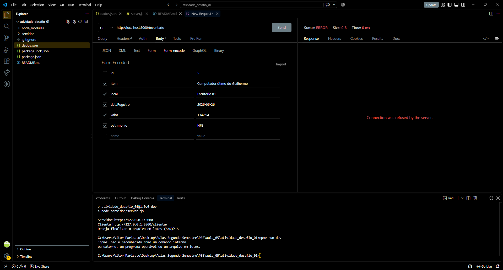

### Post

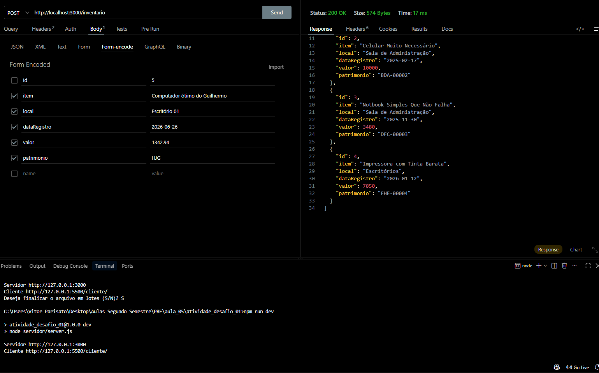

### Put

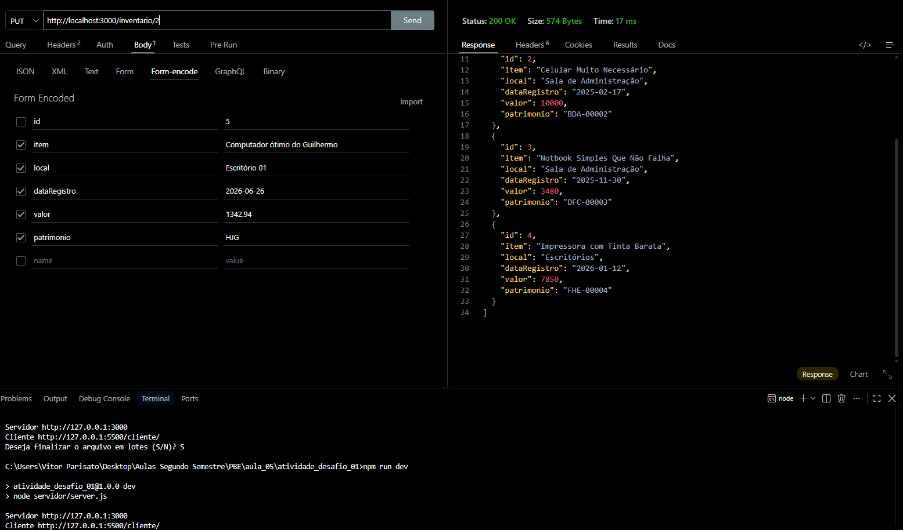

### Delete

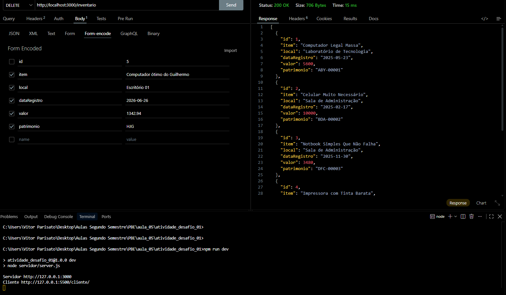

## Exemplos de Respostas

### Get

- resposta01

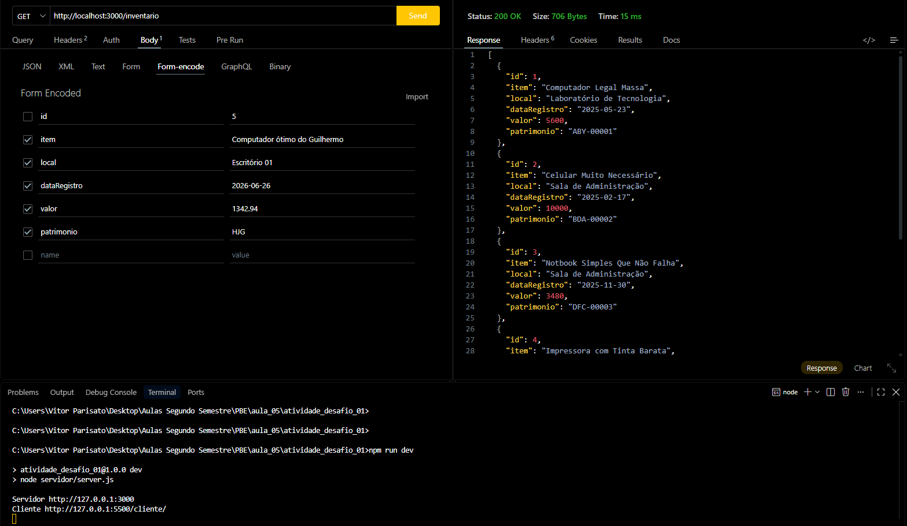

- resposta02

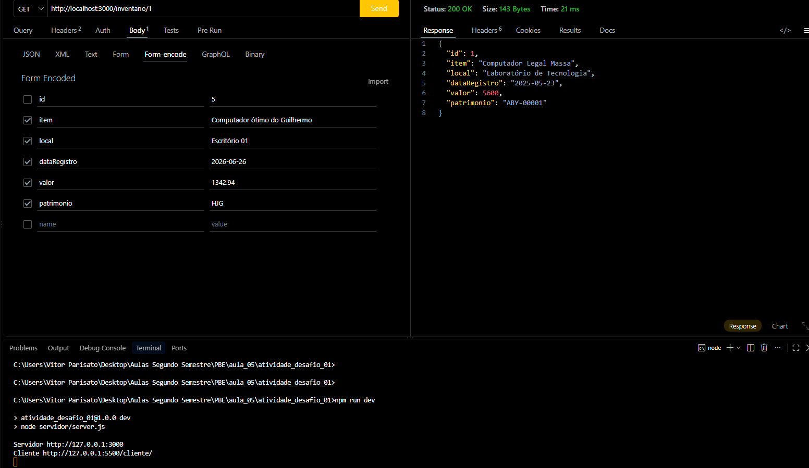

- erro

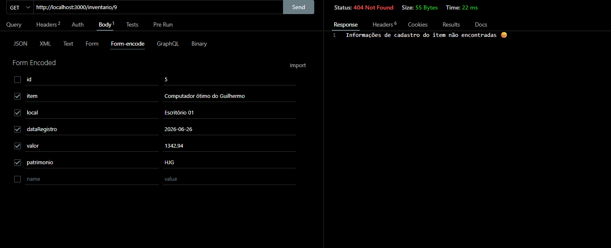

### Post

- resposta01

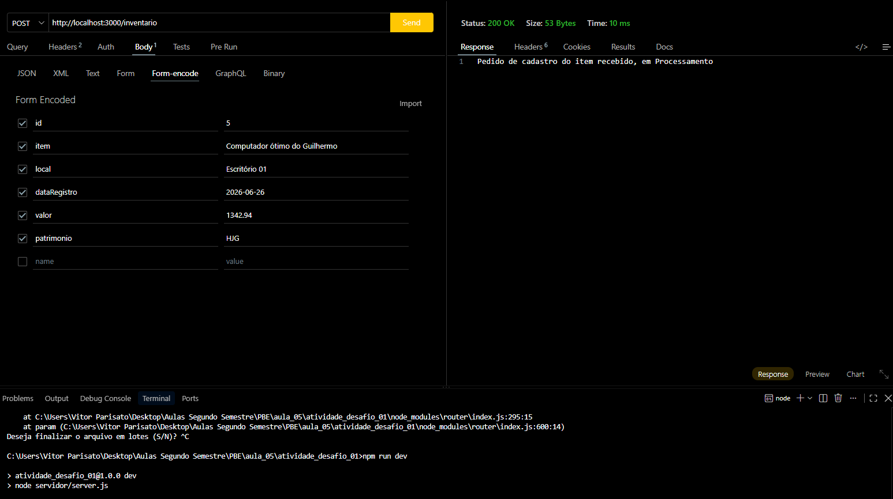

- resposta02

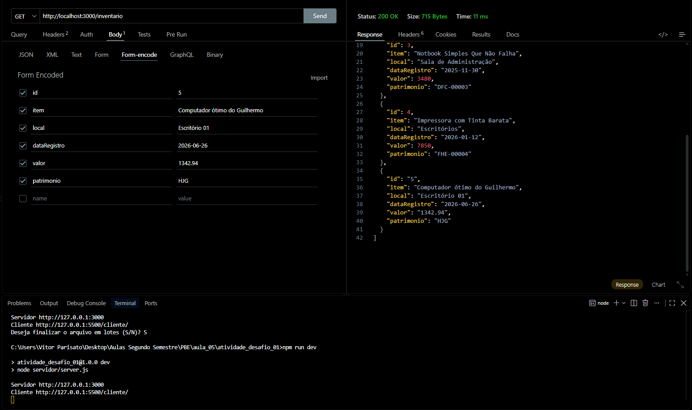

### Put

- resposta01

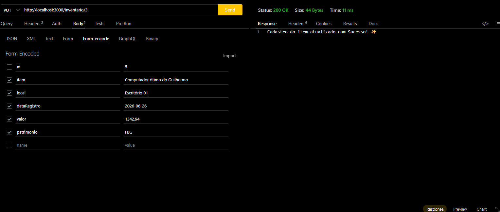

- resposta02

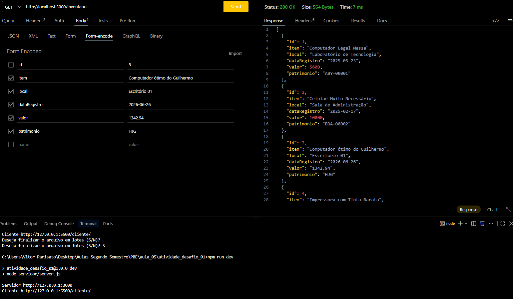

### Delete

- resposta01

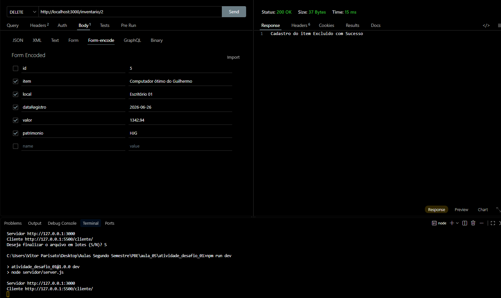

- resposta02

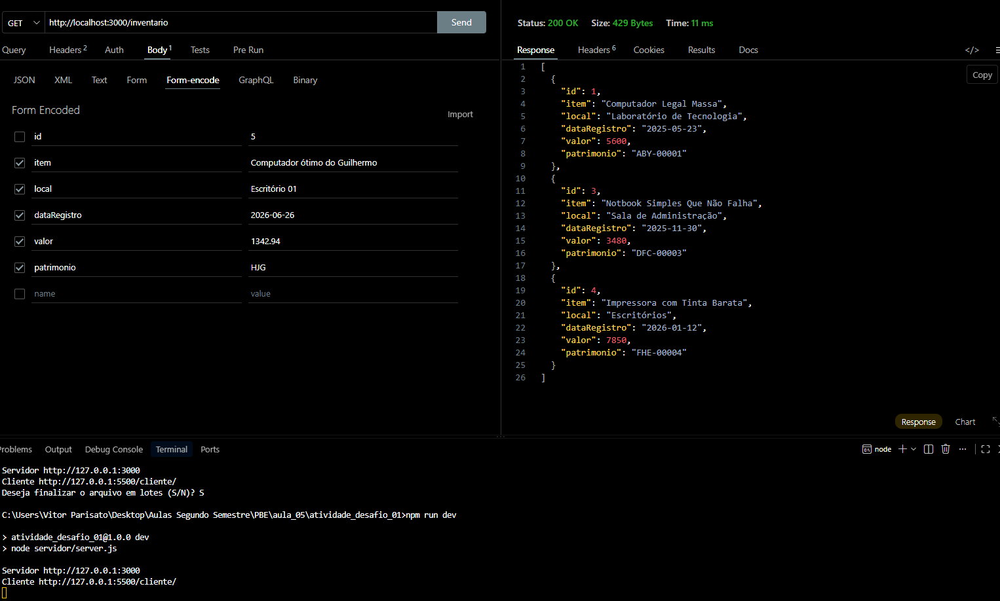

- erro

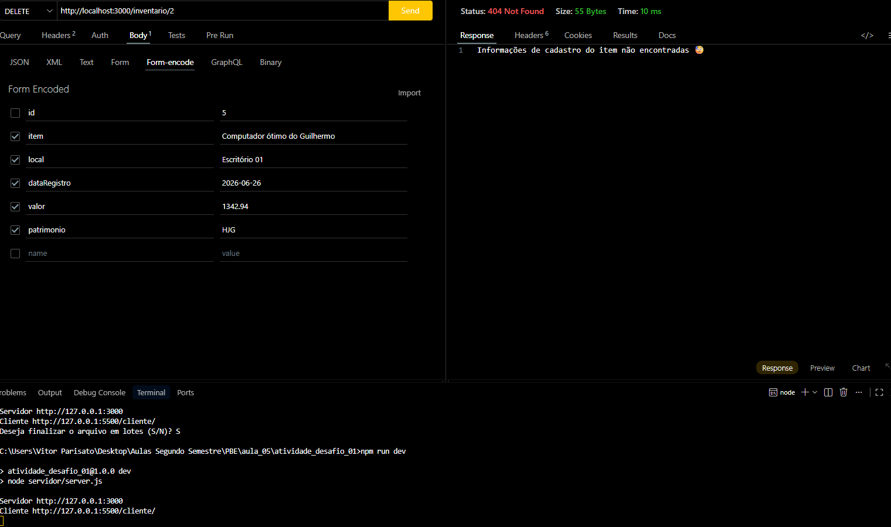