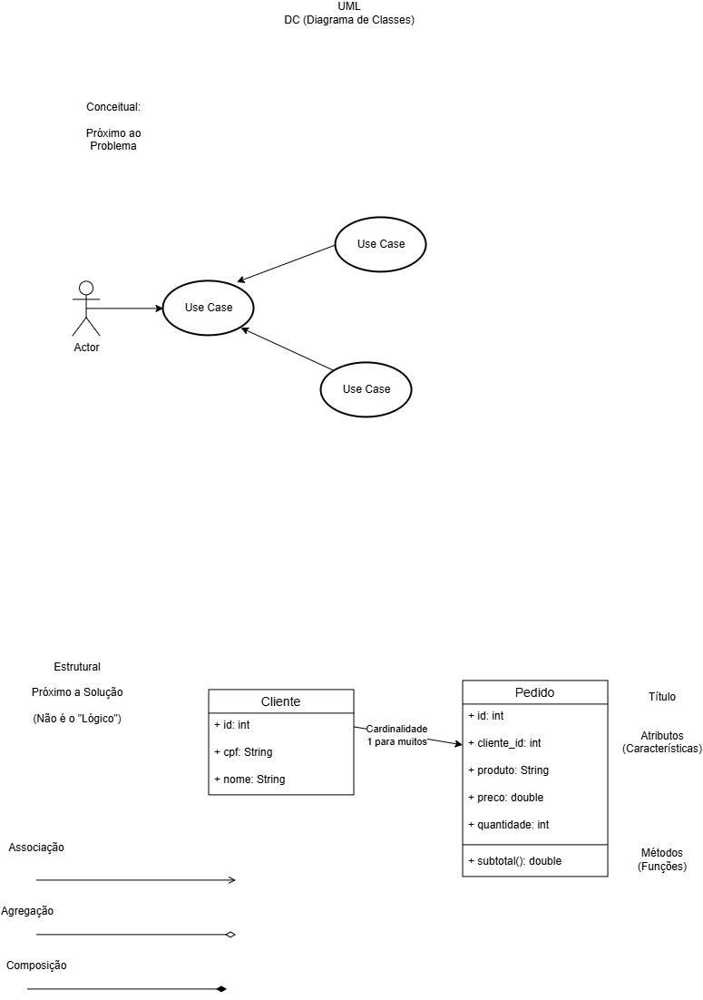

# Pedidos Backend MVC DC
Back-end com duas coleções mockup JSON clientes e pedidos, CRUD, para aprender MVC e UML diagrama de classes

## Testes Alterar


## Textes Excluir


## Diagramas



## Tecnologias
- node.js
- VsCode (Thunder Client)
- JavaScript
- MVC

## Passos para Testar
- Clone esta repositório e abra com VsCode
- Instale as depenências e execute com os seguintes comandos no terminal:
```
npm install
npm run dev
```